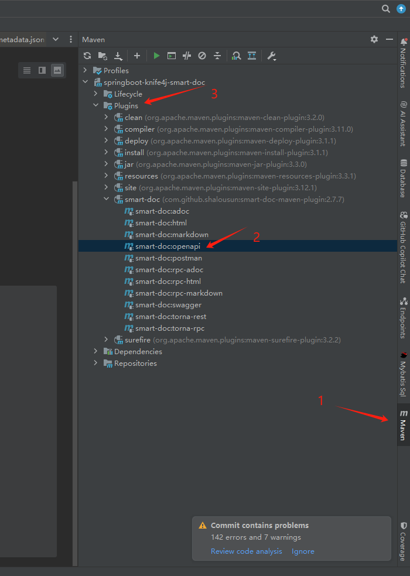

# 集成springboot3 knif4j smart-doc案例

## 1. 编译教程

使用idea编译




使用maven 命令编译

```java
//生成html
mvn -Dfile.encoding=UTF-8 smart-doc:html
//生成markdown
mvn -Dfile.encoding=UTF-8 smart-doc:markdown
//生成adoc
mvn -Dfile.encoding=UTF-8 smart-doc:adoc
//生成postman json数据
mvn -Dfile.encoding=UTF-8 smart-doc:postman
// 生成 Open Api 3.0+,Since smart-doc-maven-plugin 1.1.5
mvn -Dfile.encoding=UTF-8 smart-doc:openapi
// 生成文档推送到Torna平台
mvn -Dfile.encoding=UTF-8 smart-doc:torna-rest
// 生成word格式文档，推荐使用smart-doc 3.0.2及更高版本
mvn -Dfile.encoding=UTF-8 smart-doc:word
// 生成jmeter性能压测脚本
mvn -Dfile.encoding=UTF-8 smart-doc:jmeter

// Apache Dubbo RPC文档
// Generate html
mvn -Dfile.encoding=UTF-8 smart-doc:rpc-html
// Generate markdown
mvn -Dfile.encoding=UTF-8 smart-doc:rpc-markdown
// Generate adoc
mvn -Dfile.encoding=UTF-8 smart-doc:rpc-adoc

// 生成dubbo接口文档推送到torna
mvn -Dfile.encoding=UTF-8 smart-doc:torna-rpc
```